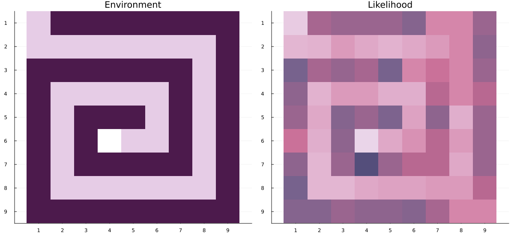
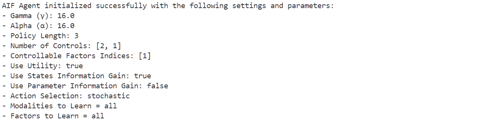

# ActiveInference.jl

[](https://ilabcode.github.io/ActiveInference.jl/stable/Introduction/)
[](https://github.com/samuelnehrer02/ActiveInference.jl/actions/workflows/CI_full.yml?query=branch%3Amaster)
[](https://codecov.io/gh/samuelnehrer02/ActiveInference.jl)
[](https://opensource.org/licenses/MIT)
[](https://github.com/JuliaTesting/Aqua.jl)

ActiveInference.jl is a new Julia package for the computational modeling of active inference. We provide the necessary infrastructure for defining active inference models, currently implemented as partially observable Markov decision processes. After defining the generative model, you can simulate actions using agent-based simulations. We also provide the functionality to fit experimental data to active inference models for parameter recovery. 


* Example visualization of an agent navigating a maze, inspired by the one described in [Bruineberg et al., 2018](https://www.sciencedirect.com/science/article/pii/S0022519318303151?via%3Dihub).
Left: A synthetic agent wants to reach the end of the maze environment while avoiding dark-colored locations.
Right: The agent's noisy prior expectations about the state of the environment parameterized by Dirichlet distributions are updated dynamically as it moves through the maze.

## News
#### Version 0.1.1 - December 2024
- Initial release of the package documentation. 


## Installation
Install ActiveInference.jl using the Julia package manager:
````@example Introduction
using Pkg
Pkg.add("ActiveInference")

using ActiveInference
````


## Getting Started 

### Understanding Vector Data Types in ActiveInference.jl
The generative model is defined using vectors of arrays, where each element can itself be a multi-dimensional array or matrix. For example: 

* If there is only one modality
````@example Introduction

# Initialize States, Observations, and Controls
states = [25]
observations = [25]
controls = [2] # Two controls (e.g. left and right)
policy_length = 2

# Generate random Generative Model 
A, B = create_matrix_templates(states, observations, controls, policy_length);

# Here, the A_matrix is a one element Vector{Matrix{Float64}} where the element is a 25x25 Matrix
size(A[1]) 

````

* If there are more modalities
````@example Introduction

# Initialize States, Observations, and Controls
states = [25,2] 
observations = [25,2]
controls = [2,1] # Only the first factor is controllable (e.g. left and right)
policy_length = 2

# Generate random Generative Model 
A, B = create_matrix_templates(states, observations, controls, policy_length);

# Each modality is stored as a separate element.
size(A[1]) # Array{Float64, 3} with these dimensions: (25, 25, 2)
size(A[2]) # Array{Float64, 3} with these dimensions: (2, 25, 2)

````
More detailed description of Julia arrays can be found in the official [Julia Documentation](https://docs.julialang.org/en/v1/base/arrays/)

### Basic Usage 

````@example Introduction
# Define some settings as a dictionary.
settings = Dict( "policy_len" => 3)

# Define some parameters as a dictionary.
parameters = Dict("alpha" => 16.0 )

# Initialize the AIF-type agent.
aif = init_aif(A,
               B;
               settings = settings,
               parameters = parameters);
````

````@example Introduction
# Give observation to the agent and run state inference.
observation = [3,1]
infer_states!(aif, observation)

# Infer policies 
infer_policies!(aif)

# Sample action
sample_action!(aif)

````